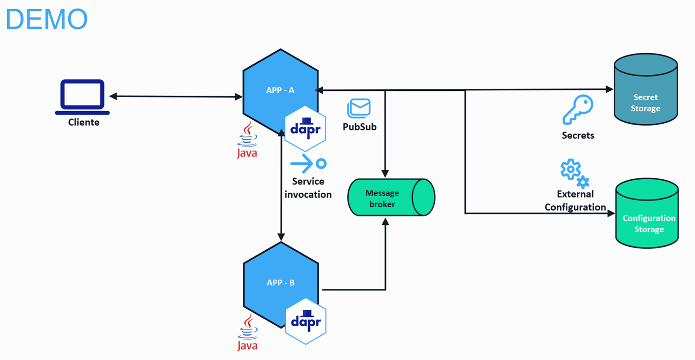
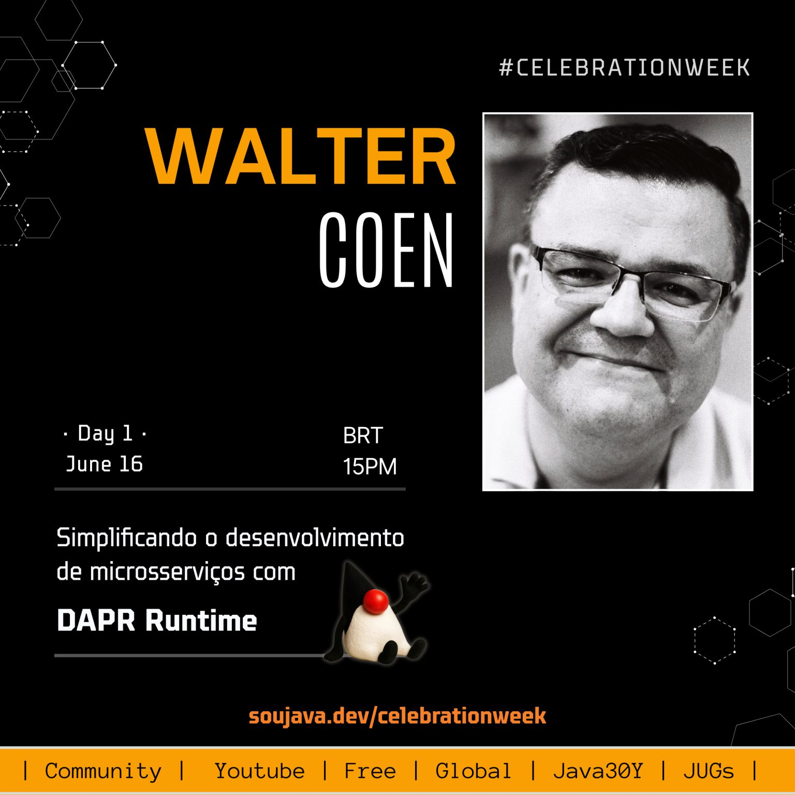

# SouJava 2025 - 30 anos - Simplificando o desenvolvimento de microsserviços com o Dapr 🎩 Runtime.

Apresentação realizada 16/06/2025 no evento virtual da comunidade SouJava pelos 30 anos da linguagem Java, sobre como simplificar o desenvolvimento de microsserviços com o Dapr Runtime.

[](https://skillicons.dev)



## Evento



[Programação](https://soujava.github.io/java30y-celebration-week/)

[Download Slides](./imgs/soujava2025-30anos-dapr.pdf)

## Configuração do ambiente

- [Instalar o Docker] (https://docs.docker.com/engine/install/)
- [Instalar o Dapr CLI](https://docs.dapr.io/getting-started/install-dapr-cli/)
- [Opcional: VSCode Dapr Extension](https://marketplace.visualstudio.com/items?itemName=ms-azuretools.vscode-dapr)
- Configuração do ambiente de desenvolvimento
- Criar um arquivo .gitignore
- Instalar o Maven no codespace

```bash
sudo su
apt-get update -y
apt-get upgrade -y
apt-get install maven -y
exit
```

## Configuração dos projetos
- Criar na raiz um arquivo chamado pom.xml
```bash
<?xml version="1.0" encoding="UTF-8"?>
<project xmlns="http://maven.apache.org/POM/4.0.0" xmlns:xsi="http://www.w3.org/2001/XMLSchema-instance"
    xsi:schemaLocation="http://maven.apache.org/POM/4.0.0 https://maven.apache.org/xsd/maven-4.0.0.xsd">
    <modelVersion>4.0.0</modelVersion>

    <groupId>dev.soujava</groupId>
    <artifactId>soujava-cncf-dapr</artifactId>
    <version>1.0</version>
    <packaging>pom</packaging>
    <name>Multi Project: SOUJAVA CNCF DAPR</name>

    <modules>

    </modules>
</project>
```
### Criação do projeto app-a
- Teclar F1 e digitar spring initializr: create a maven project
    - Versão do spring: última estável (ex: 3.4.5)
    - Linguagem: Java lindo ❤️
    - Group Id: dev.soujava
    - Artifact Id: app-a
    - Packaging: JAR
    - Java version: 21
    - Dependencies: Spring Web
    - Selecione a pasta sugerida pelo VSCode

- Modificar o arquivo pom.xml na raiz do repositório para identificar o projeto

```bash
<?xml version="1.0" encoding="UTF-8"?>
<project xmlns="http://maven.apache.org/POM/4.0.0" xmlns:xsi="http://www.w3.org/2001/XMLSchema-instance"
    xsi:schemaLocation="http://maven.apache.org/POM/4.0.0 https://maven.apache.org/xsd/maven-4.0.0.xsd">
    <modelVersion>4.0.0</modelVersion>

    <groupId>dev.soujava</groupId>
    <artifactId>soujava-cncf-dapr</artifactId>
    <version>1.0</version>
    <packaging>pom</packaging>
    <name>Multi Project: SOUJAVA CNCF DAPR</name>

    <modules>
        <module>app-a</module>
    </modules>
</project>
```
- Teclar F1 e digitar java:clean java language server workspace
- Iniciar o ambiente do Dapr Runtime

```bash
dapr init
docker ps
```
- Criar uma configuração

```bash
docker exec dapr_redis redis-cli MSET URL_DATABASE "jdbc:mysql://localhost/test?user=root&password=senha"
```

- Modificar o arquivo pom.xml do projeto app-a para incluir as dependencias do Dapr
```xml
    <dependency>
        <groupId>io.dapr</groupId>
        <artifactId>dapr-sdk</artifactId>
        <version>1.14.1</version>
    </dependency>
    <dependency>
        <groupId>io.dapr</groupId>
        <artifactId>dapr-sdk-springboot</artifactId>
        <version>1.14.1</version>
    </dependency>
    <dependency>
        <groupId>io.dapr.spring</groupId>
        <artifactId>dapr-spring-boot-starter</artifactId>
        <version>0.14.1</version>
    </dependency>
```

## Construindo o padrão Service Invocation

- [Documentação](https://docs.dapr.io/developing-applications/building-blocks/service-invocation/service-invocation-overview/)
- [Dapr SDK Java](https://docs.dapr.io/developing-applications/sdks/java/java-client/)

- Criar na raiz do projeto um arquivo dapr.yaml

```bash
version: 1
common:
  resourcesPath: ./components/
apps:
  - appID: app-a
    appDirPath: ./app-a/target/
    appPort: 8080
    command: ["java", "-jar", "app-a-0.0.1-SNAPSHOT.jar"]
```
- Criar no projeto a pasta components

- No projeto app-a dentro do pacote java.dev.soujava.app_a um pacote controller e a classe HomeController.java

```java
package dev.soujava.app_a.controller;

import org.springframework.web.bind.annotation.RestController;
import org.springframework.web.bind.annotation.RequestMapping;
import org.springframework.web.bind.annotation.GetMapping;
import org.springframework.http.ResponseEntity;

@RestController
@RequestMapping("/api")
public class HomeController {

    //  ******** APPLICAÇÃO A  ************

    @GetMapping()
    public ResponseEntity index() {
        return ResponseEntity.ok().body("Hello from App A");
    }
}
```

- Executar o Maven para fazer o build da aplicação e em seguida o Dapr para executar a aplicação com o side car

```bash
mvn package -DskipTests
```

- Pressione F5 para que o comando abaixo seja executado

```bash
dapr run -f dapr.yaml
```

- Criar na raiz do projeto um arquivo teste.rest com a chamada para o método

```bash
### App A GET
GET http://localhost:8080/api
```

- Abra um novo bash para testar a invocação pelo Dapr

```bash
dapr invoke -a app-a --method api --verb GET
```

- Utilize o comando Control + C para interromper a execução do Dapr

### Criação do projeto app-b
- Teclar F1 e digitar spring initializr: create a maven project
    - Versão do spring: última estável (ex: 3.4.5)
    - Linguagem: Java lindo ❤️
    - Group Id: dev.soujava
    - Artifact Id: app-b
    - Packaging: JAR
    - Java version: 21
    - Dependencies: Spring Web
    - Selecione a pasta sugerida pelo VSCode

- Modificar o arquivo pom.xml na raiz do repositório para identificar o projeto

```bash
<?xml version="1.0" encoding="UTF-8"?>
<project xmlns="http://maven.apache.org/POM/4.0.0" xmlns:xsi="http://www.w3.org/2001/XMLSchema-instance"
    xsi:schemaLocation="http://maven.apache.org/POM/4.0.0 https://maven.apache.org/xsd/maven-4.0.0.xsd">
    <modelVersion>4.0.0</modelVersion>

    <groupId>dev.soujava</groupId>
    <artifactId>soujava-cncf-dapr</artifactId>
    <version>1.0</version>
    <packaging>pom</packaging>
    <name>Multi Project: SOUJAVA CNCF DAPR</name>

    <modules>
        <module>app-a</module>
        <module>app-b</module>
    </modules>
</project>
```
- Teclar F1 e digitar java:clean java language server workspace
- Iniciar o ambiente do Dapr Runtime

- Modificar o arquivo pom.xml do projeto app-a para incluir as dependencias do Dapr
```xml
    <dependency>
        <groupId>io.dapr</groupId>
        <artifactId>dapr-sdk</artifactId>
        <version>1.14.1</version>
    </dependency>
    <dependency>
        <groupId>io.dapr</groupId>
        <artifactId>dapr-sdk-springboot</artifactId>
        <version>1.14.1</version>
    </dependency>
    <dependency>
        <groupId>io.dapr.spring</groupId>
        <artifactId>dapr-spring-boot-starter</artifactId>
        <version>0.14.1</version>
    </dependency>
```

- Modifique o arquivo do projeto app-b no pacote src/main/resources/application.properties para modificar a porta que a API será servida
```bash
spring.application.name=app-b
server.port=8081
```

- Modifique na raiz do projeto o arquivo dapr.yaml

```bash
version: 1
common:
  resourcesPath: ./components/
apps:
  - appID: app-a
    appDirPath: ./app-a/target/
    appPort: 8080
    command: ["java", "-jar", "app-a-0.0.1-SNAPSHOT.jar"]
  - appID: app-b
    appDirPath: ./app-b/target/
    appPort: 8081
    command: ["java", "-jar", "app-b-0.0.1-SNAPSHOT.jar"]        
```

- No projeto app-b dentro do pacote java.dev.soujava.app_b um pacote controller e a classe HomeController.java

```java
package dev.soujava.app_b.controller;

import org.springframework.web.bind.annotation.RestController;
import org.springframework.web.bind.annotation.RequestMapping;
import org.springframework.web.bind.annotation.GetMapping;
import org.springframework.http.ResponseEntity;

@RestController
@RequestMapping("/api")
public class HomeController {
    
    //  ******** APPLICAÇÃO B  ************

    @GetMapping()
    public ResponseEntity index() {
        return ResponseEntity.ok().body("Hello from App B");
    }
}
```

- Executar o Maven para fazer o build da aplicação e em seguida o Dapr para executar a aplicação com o side car

```bash
mvn package -DskipTests
dapr run -f dapr.yaml
```

- Modifique o arquivo teste.rest com a chamada para o método

```bash
### App B GET
GET http://localhost:8081/api
```

- Abra um novo bash para testar a invocação pelo Dapr

```bash
dapr invoke -a app-b --method api --verb GET
```

### Invocação Síncrona

- Altere a classe HomeController.java do projeto app-a para fazer uma chamada síncrona para a app-b
```java
private static final String SERVICE_APP_B = "app-b";

@PostMapping("/startsync")
public ResponseEntity startASync() {
    System.out.println("App A started");
    try(DaprClient daprClient = new DaprClientBuilder().build()){
        var message = "Hello from App A";
        daprClient.invokeMethod(SERVICE_APP_B, "/api/startsync", message, HttpExtension.POST).block();

        
    }catch (Exception e) {
        System.out.println("Error: " + e.getMessage());
        return ResponseEntity.status(500).body("Error starting App A");
    }
    return ResponseEntity.ok().body("App A started");
}
```

- Altere a classe HomeController.java do projeto app-b para possuir um método que será chamado pela app-a
```java
@PostMapping("/startsync")
public ResponseEntity startBSync(@RequestBody String message) {
    System.out.println("App B started");
    System.out.println("Message received: " + message);
    return ResponseEntity.ok().body("App B started");
}
```

- Executar o Maven para fazer o build da aplicação e em seguida o Dapr para executar a aplicação com o side car

```bash
mvn package -DskipTests
dapr run -f dapr.yaml
```

- Modifique o arquivo teste.rest com a chamada para o método

```bash
### App A POST /startsync
POST http://localhost:8080/api/startsync
```

### Invocação Assíncrona

- [Publisher/Subscriber](https://docs.dapr.io/developing-applications/building-blocks/pubsub/pubsub-overview/)
- [Dapr SDK Java](https://docs.dapr.io/developing-applications/sdks/java/java-client/)

- Crie dentro da pasta components, um arquivo chamado pubsub.yaml

```yaml
apiVersion: dapr.io/v1alpha1
kind: Component
metadata:
  name: pubsub-dapr
spec:
  type: pubsub.redis
  version: v1
  metadata:
  - name: redisHost
    value: localhost:6379
  - name: redisPassword
    value: ""
scopes:
  - app-a
  - app-b
```

- Altere a classe HomeController.java do projeto app-a para fazer uma chamada assíncrona para a app-b publicando um evento
```java
private static final String PUBSUBNAME = "pubsub-dapr";
private static final String TOPICNAME = "topicodapr";

@PostMapping("/startasync")
public ResponseEntity startAASync() {
    System.out.println("App A started");
    try(DaprClient daprClient = new DaprClientBuilder().build()){
        var message = "Hello from App A";
        daprClient.publishEvent(PUBSUBNAME, TOPICNAME, message).block();

    }catch (Exception e) {
        System.out.println("Error: " + e.getMessage());
        return ResponseEntity.status(500).body("Error starting App A");
    }
    return ResponseEntity.ok().body("App A started");
}
```

- Altere a classe HomeController.java do projeto app-b para possuir um método que irá consumir os eventos publicados por app-a
```java
@Topic(pubsubName = "pubsub-dapr", name = "topicodapr")
@PostMapping(path="/startasync", consumes = MediaType.ALL_VALUE)
public ResponseEntity startBASync(@RequestBody(required = false) CloudEvent<String> cloudEvent) {
    System.out.println("App B started");
    var idMessage = cloudEvent.getId();
    var message = cloudEvent.getData();
    System.out.println("Message " + idMessage +  " received: " + message);
    return ResponseEntity.ok().body("App B started");
}
```

- Executar o Maven para fazer o build da aplicação e em seguida o Dapr para executar a aplicação com o side car

```bash
mvn package -DskipTests
dapr run -f dapr.yaml
```

- Modifique o arquivo teste.rest com a chamada para o método

```bash
### App A POST /startasync
POST http://localhost:8080/api/startasync
```

### Armazenamento de estado

- [State Manager](https://docs.dapr.io/developing-applications/building-blocks/state-management/state-management-overview/)
- [Dapr SDK Java](https://docs.dapr.io/developing-applications/sdks/java/java-client/)

- Crie dentro da pasta components, um arquivo chamado statestore.yaml
```yaml
apiVersion: dapr.io/v1alpha1
kind: Component
metadata:
  name: statestore
spec:
  type: state.redis
  version: v1
  metadata:
  - name: redisHost
    value: localhost:6379
  - name: redisPassword
    value: ""
scopes:
  - app-a
  - app-b
```

- Altere a classe HomeController.java do projeto app-a ter um endpoint responsável por gravar no state store, e outro para ler do state store
```java

private static final String STORENAME = "statestore";

@PostMapping("/state/{msg}")
public ResponseEntity postState(@PathVariable String msg) {
    System.out.println("App A started");
    try(DaprClient daprClient = new DaprClientBuilder().build()){

        daprClient.saveState(STORENAME, "CHAVE", msg).block();

        
    }catch (Exception e) {
        System.out.println("Error: " + e.getMessage());
        return ResponseEntity.status(500).body("Error starting App A");
    }
    return ResponseEntity.ok().body("App A started");
}

@GetMapping("/state")
public ResponseEntity getState() {
    System.out.println("App A started");
    try(DaprClient daprClient = new DaprClientBuilder().build()){


        var retorno = daprClient.getState(STORENAME, "CHAVE", String.class);
        var msg = retorno.block().getValue();
        System.out.println("Retorno: " + msg);
        return ResponseEntity.ok().body(msg);

    }catch (Exception e) {
        System.out.println("Error: " + e.getMessage());
        return ResponseEntity.status(500).body("Error starting App A");
    }
    
}
```
- Altere a classe HomeController.java do projeto app-b ter um endpoint responsável por gravar no state store, e outro para ler do state store
```java

private static final String STORENAME = "statestore";

@PostMapping("/state/{msg}")
    public ResponseEntity postState(@PathVariable String msg) {
        System.out.println("App B started");
        try(DaprClient daprClient = new DaprClientBuilder().build()){

            daprClient.saveState(STORENAME, "CHAVE", msg).block();

            
        }catch (Exception e) {
            System.out.println("Error: " + e.getMessage());
            return ResponseEntity.status(500).body("Error starting App A");
        }
        return ResponseEntity.ok().body("App B started");
    }

    @GetMapping("/state")
    public ResponseEntity getState() {
        System.out.println("App B started");
        try(DaprClient daprClient = new DaprClientBuilder().build()){


            var retorno = daprClient.getState(STORENAME, "CHAVE", String.class);
            var msg = retorno.block().getValue();
            System.out.println("Retorno: " + msg);
            return ResponseEntity.ok().body(msg);

        }catch (Exception e) {
            System.out.println("Error: " + e.getMessage());
            return ResponseEntity.status(500).body("Error starting App B");
        }
        
    }
```

- Executar o Maven para fazer o build da aplicação e em seguida o Dapr para executar a aplicação com o side car

```bash
mvn package -DskipTests
dapr run -f dapr.yaml
```

- Modifique o arquivo teste.rest com a chamada para o método

```bash
### App A POST /state
POST http://localhost:8080/api/state/naoacredito

### App A GET /state
GET http://localhost:8080/api/state

### App B POST /state
POST http://localhost:8081/api/state/naoacredito1

### App B GET /state
GET http://localhost:8081/api/state
```